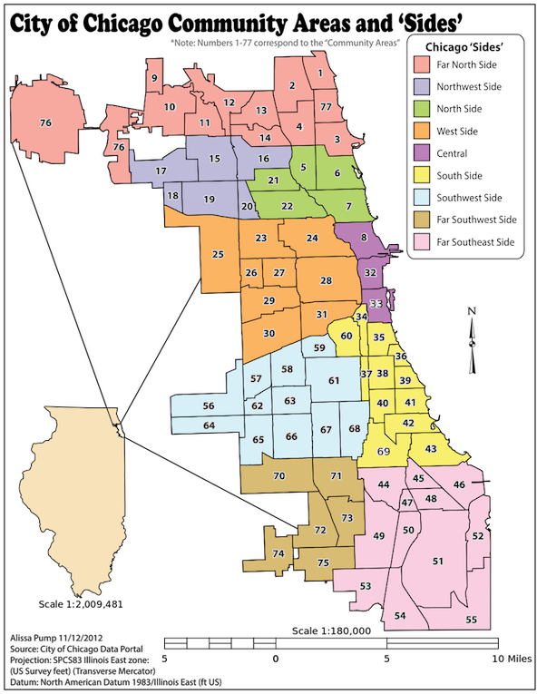

A Data Science project in Taxi Domain
===================
`#DataScience` `#PySpark` `#Python` `#MachineLearning` `#BigData` `#Spark` `#Taxi` `#Fare`


## Objetive

The main objective of this project is to try to predict the price that a taxi will cost us in Chicago based on the data of other trips made in this city and adding information about the weather. 

Chicago, located in the state of Illinois, is the third most populated city in the USA behind New York and Los Angeles. With a population of around 2.7 million inhabitants and an area of 606.1 km2, it is made up of 77 community areas with the following distribution:



Note: This document briefly describes what has been carried out during this project and there is more detail in each of the notebooks.

## About the methodology 
The CRISP-DM (*cross-industry process for data mining*) methodology provides a structured approach to planning a data mining task and was applied to this data science project.


The steps we are going to take to build a model that allows us to obtain the best possible price to reality will be as follows:
1. Data acquisition: In this first step what we will do is look for all the possible information which will allow us to carry out our analysis in the most complete way possible.
2. Data Cleaning and Preparation: In this second step, by means of a detailed analysis of the data which allows us to eliminate those trips in taxi with erroneous values or outliers, the creation of new feautures that improve our model and the visualization of the data, we will try to prepare our dataset to carry out the modeling as clean as possible.
3. Analysis and Modelling: In this third step, we will carry out the exploration of different modeling methods, which will allow us to observe which one best adapts to our data and its hyperparameters.
4. Visualization: In this last section, what will be done is to visualize the dataset prepared in step 2 and the conclusions obtained in step 3.


## About the technology 
### Programming languages

 - Spark Python API (**PySpark**) : Used practically throughout the project as a result of the large amount of data that has been worked with.
 - **Python** Used for the study of Pickup points or Dropoff points of taxis that may be in the water and for the construction of the model.

### Libraries to install

The first thing we have to do is prepare an eviroment to be able to run all the code. Then we are going to run the next commands in a Terminal (maybe bash):

1. Libraries to run the code
````sh
conda install jupyter
conda install pyspark
conda install numpy
conda install pandas
conda install matplotlib
conda install seaborn
conda install scikit-learn
conda install -c conda-forge xgboost
````

2. Library to download the data from Google Drive:

````sh
pip install googledrivedownloader
````

## Data acquisition

1. The Taxi Trips dataset was provided by Chicago Data Portal [here](https://data.cityofchicago.org/Transportation/Taxi-Trips/wrvz-psew) and consists in a `csv` file with *112.860.054 rows*, *24 columns* and *45,75 GB*.

	- A codebook of the data set is available [here](Information/CodeBookTaxiTrips.pdf).

2. The Weather dataset was provided by Kaggle [here](https://www.kaggle.com/selfishgene/historical-hourly-weather-data) and consists of a folder with 7 CSVs referring to different cities of USA, Canada and Israel, which have data referring to:

	1. City Attributes
	2. Humidity
	3. Pressure
	4. Temperature
	5. Weather Description
	6. Wind Direction
	7. Wind Speed

3. We have obtained from [here](https://www.openstreetmap.org/export#map=10/41.8453/-87.7400) a map of the city of Chicago which will be used to eliminate those points that are in the water. With the help of Adobe Photoshop the color of the water has been highlighted, darkening in turn the color of the earth.

4. We have also created an Excel file with translation of the referent fields Pickup Community Area and Dropoff Community Area [here](Information/Community_Areas_and_Neigborhoods_City_of_Chicago.xlsx).

All this information can be downloaded by running the notebook: [`download_files_drive.ipynb`](Scripts/download_files_drive.ipynb) 


## Data cleaning and Preparation (EDA)

### Description
The main tasks during this phase were transforming data, dealing with missing values,filter outliers and strange values and visualizing raw data by plotting frequency.

### Notebooks used
In this phase, several notebooks have been used, being these the following ones:

#### Notebooks used for the analysis and treatment of the Chicago Taxi Trips dataset:

1. [`exploratory_taxi_data.ipynb`](Scripts/exploratory_taxi_data.ipynb): In this notebook with the help of **PySpark** what has been done is to perform a first analysis of the dataset of taxi journeys following the next steps: 
		
	1. We have carried out a transformation of the names of the fields to comply with good practices.
	2. We have converted the dates to date format.
	3. We have analyzed the most repeated values in each of the axes.
	4. We have eliminated the useless columns
 	5. Finally we have analyzed the values null and strange making a count of how many trips would remain after this first analysis.
	
2. [`filtering_taxi_trip_data.ipynb`](Scripts/filtering_taxi_trip_data.ipynb): In this notebook what has been done has been based on the analysis carried out in the previous notebook to carry out the erasure of the useless axes, the change of name of the columns, the change of format of the date fields, the filtering of the trips with strange values and the elimination of the trips with null values and finally it has been saved in a new CSV (A separate notebook has been used for the whole process of the first notebook to be able to perform the filtering without running the previous notebook).
	
3. [`delete_location_water.ipynb`](Scripts/delete_location_water.ipynb): In this notebook what has been done is to represent in the map of Chicago the Pickup and Dropoff points of the remaining trips of the filtering carried out in the previous notebook. The idea is all those trips that have the point of departure or arrival in the water eliminate them. 
	
	After carrying out this analysis have been found a residual number of departure or arrival points in the water so it has been decided not to eliminate them.

#### Notebooks used for the analysis and treatment of the Chicago Weather:

1. [`exploratory_filtering_chicago_weather_data.ipynb`](Scripts/exploratory_filtering_chicago_weather_data.ipynb): In this notebook what we do is read 6 of the 7 downloaded files (City Attributes we don't use it), keep the information about Chicago and do an exploration of the data.

#### Notebooks used for the analysis, treatment and union of the Taxi Trips and Weather datasets resulting from the previous processing:

1. [`final_eda.ipynb`](Scripts/final_eda.ipynb): In this last notebook before entering the modeling, what has been done is to join the datasets of Chicago Taxis and Chicago time generated in previous notebooks, to later make a more exhaustive analysis which has allowed us to make a deeper filtering.

	Once this has been done, we have taken a visualization of the data, an analysis of the variables that most influence the price of the taxi to finally create the datasets with which to carry out the modeling and visualization.

## Analysis and Modelling

In the notebook [`sample_model.ipynb`](Scripts/sample_model.ipynb), starting from the `taxi_model_sample001.csv` (Dataset obtained in the notebook `final_eda.ipynb` and which is a sample of 1% of the total data) what we have done is try to choose the model that best suits our data and its hyperparameters from among:

1. Decision Tree Regressor
2. Random Forest Regressor
3. Xgboost Regressor
4. Bagging Regressor + Decision Tree Regressor
5. Bagging Regressor + Xgboost Regressor

Once we have observed that the model **Bagging Regressor + Xgboost Regressor** with a **depth of 5** is the best predicted, what we have done is to establish the number of estimators that would allow us to improve our prediction.

After observing that the **Bagging Regressor + Xgboost Regressor with a depth of 5 and 120 estimators** was the model that gave us the best results, we went on to calculate the test error that is $2.60.

This already trained model has been stored in a pickle [`bagging_xgboost_d5_es120.pkl`](Scripts/bagging_xgboost_d5_es120.pkl) for later use.

Finally we have repeated in the notebook [`final_eda.ipynb`](Scripts/final_eda.ipynb) the previous step with the complete CSV `taxi_model.csv` also obtained in the notebook `final_eda.ipynb`. 
It has not been possible to model for the whole dataset, due to the lack of memory in the computer, this problem could be solved with a cluster.

Our score has been Root-mean-square deviation (RMSE).

## Visualization

In this last section we have carried out a visualization in Tableau of the most interesting and relevant aspects. 

The tableau created, with the `taxi_visualized_sample.csv`, can be observed in Tableau Public [here](https://public.tableau.com/profile/alvaro.santiago.fernandez.malagon#!/vizhome/ChicagoTaxiVisualization/TaxiTripsVisualization?publish=yes) or in the tableau uploaded to the repository [`Chicago_Taxi_Visualization.twbx`](Visualization/Chicago_Taxi_Visualization.twbx).

Note: In this repository you can also find the Tableau created with the complete csv `taxi_visualized.csv` (29 million records). However, due to the size it has not been possible to upload the .tbwx to the repository nor to upload it to the Tableau Public [`Chicago_Taxi_Visualization_Full_Data.twb`](Visualization/Chicago_Taxi_Visualization_Full_Data.twb).

## Next Steps

Although it has not been possible to model with 100% of the data, a fairly accurate model has been achieved with an RMSE of $2.60. 

The next steps will be to set up a cluster that allows us to model with 100% of the data and which will assume the very likely improvement of our results. 

## About the author

**Álvaro Santiago Fernándes Malagón**

IT & Data Internal Auditor BBVA [LinkedIn](https://www.linkedin.com/in/alvaro-fernandez-malagon-55aa4ab0)